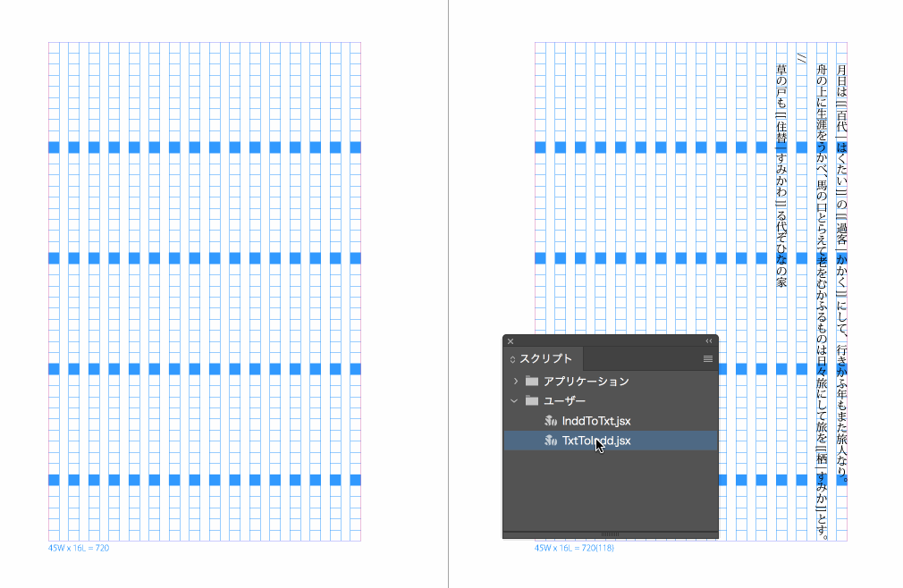
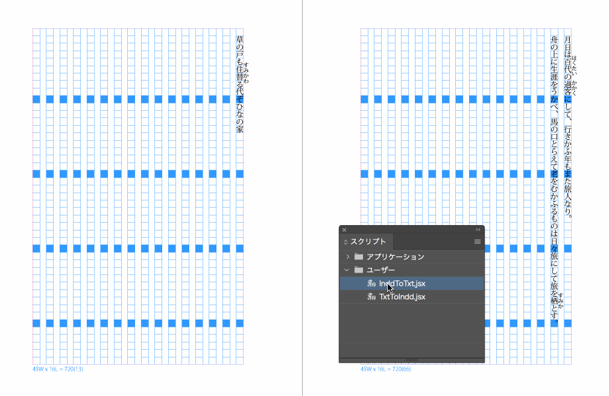

indd
----

インデザイン用スクリプトです。現在は下記の2種類があります。  
dist以下の`.jsx`ファイルをご利用ください。

## txtToIndd 
別アプリケーションで記述したテキストをインデザイン用に整えます。  
テキスト配置後に実行してください。

| 項目 | 処理 |
|-----|-----|
| ルビ置換 | 特定文字列で囲われた文字をルビに変換します |
| 改ページ置換 | 特定の文字列および三行以上の連続改行を改ページに変換します |
| フォーマット調整 | 行頭の空白文字を削除します。文字組設定での行頭字下げ用 |

- ※ルビは対象が1文字であっても「グループルビ」として設定します

## inddToTxt
インデザイン形式の原稿をWEB用などに整えます。  
**インデザイン上のテキストをそのまま変換します。** ファイルの書き出しは行いません。  
変換用に元原稿ファイルをコピーしてから実行することをお勧めします。

| 項目 | 処理 |
|-----|-----|
| ルビ置換 | モノルビ、グループルビが振られた文字列を特定書式に分割します |
| 改ページ置換 | 改ページおよび改段を特定文字列に変換します |
| フォーマット調整 | 行頭に空白文字を追加します |

## 共通事項
- ルビ対象およびルビは、検索の都合上任意の文字で囲われている必要があります
  - `ルビ対象(たいしょう)`などの記述には対応していません
- ルビ置き換えのデフォルト設定は[Pixiv用](https://www.pixiv.help/hc/ja/articles/235584168-%E5%B0%8F%E8%AA%AC%E4%BD%9C%E5%93%81%E3%81%AE%E6%9C%AC%E6%96%87%E5%86%85%E3%81%AB%E4%BD%BF%E3%81%88%E3%82%8B%E7%89%B9%E6%AE%8A%E3%82%BF%E3%82%B0%E3%81%AB%E3%81%A4%E3%81%84%E3%81%A6-%E3%81%9D%E3%82%8C%E3%81%9E%E3%82%8C%E3%81%AE%E6%A9%9F%E8%83%BD%E3%82%92%E6%95%99%E3%81%88%E3%81%A6%E3%81%8F%E3%81%A0%E3%81%95%E3%81%84)です
- 検索･置き換え範囲はアクティブなドキュメント全体です
  - ファイルの内容をそのまま書き換えます
  - 保存はコピーペーストや編集メニューからの書き出しを行ってください
